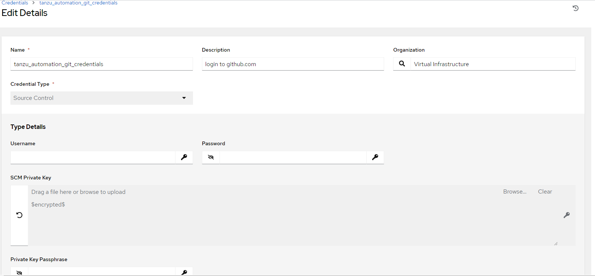
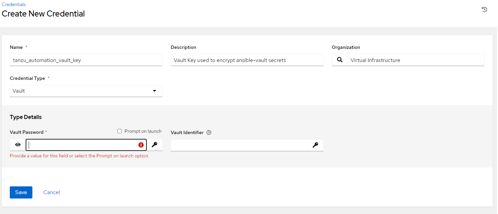
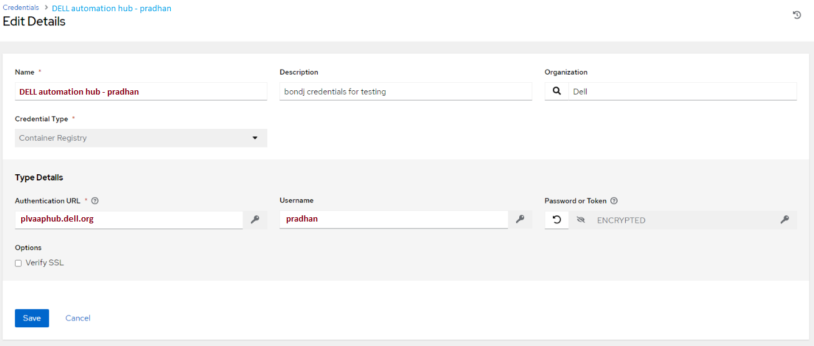
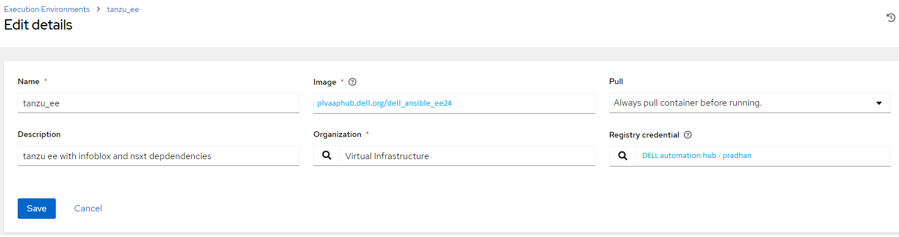
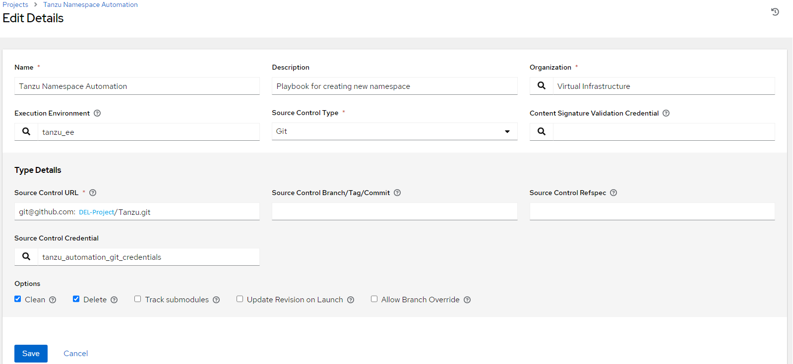
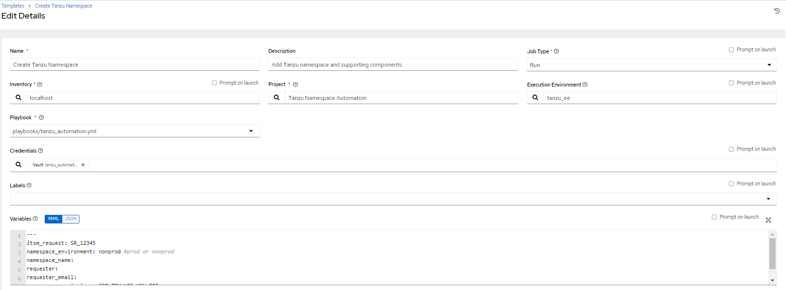

Ansible Automation Platform Deployment
==============
Overview
-----------
This document describes how to deploy the code in this repository to Ansible Automation Platform and setup AAP job templates for managing tanzu namespaces.

Contents
-----------
- [Overview](#overview)
- [Contents](#contents)
- [Git Credential Setup](#git-credential-setup)
- [Ansible Vault Setup](#ansible-vault-setup)
- [Ansible Automation Hub Setup](#ansible-automation-hub-setup)
- [Ansible Execution Environment Setup](#ansible-execution-environment-setup)
- [Project Setup](#project-setup)
- [Template Setup](#template-setup)
- [Ansible Vault](#ansible-vault)
- [References](#references)

Git Credential Setup
-----------
The Ansible Automation Platform(AAP) project uses a github deploy key to sync code between github and AAP.  A github deploy key is a public key defined inside of a github repository that can be used to access the repository and optionally write code to the repository.  The key labeled 'tanzu_automation_aap_key' in AAP is used to access this repository from AAP.  Below are the steps to regenerate the key.  

`ssh-keygen -t rsa -f ~/path/tanzu_automation_key -N ''`

This command generates a private key file named tanzu_automation_key and a public key file named tanzu_automation_key.pub.  The content of the private key file should be put into AAP as a source code credential.  The content of the public key should be added to the [github deploy key section](https://github.com/DELL-Project/Tanzu/settings/keys).  

1. Login to AAP
2. Navigate to Resources->Credentials
3. Click 'Add'
4. Select 'Source Control' as the Credential Type.
5. The content of the tanzu_automation_key should be uploaded into AAP.

Ansible Vault Setup
-----------
1. Login to AAP
2. Navigate to Resources->Credentials
3. Click 'Add' 
4. Select 'Vault' as the Credential Type.
5. Put the value of the vault password file into the textbox.

Ansible Automation Hub Setup
-----------
1. Login to AAP
2. Navigate to Resources->Credentials
3. Click 'Add' 
4. Put 'Container Registry' as the Credential Type.
5. Put 'plvaaphub.dell.org' as the value for the Authentication URL.
6. Put the user and password in the associated fields for the AAH user.

Ansible Execution Environment Setup
-----------
1. Login to AAP
2. Navigate to Administration->Execution Environments
3. Click 'Add' 
4. Put 'plvaaphub.dell.org/dell_ansible_ee24' in the image section.
5. Select 'Virtual Infrastructure' as the Organization.
5. Select the registry credential used to pull from Ansible Automation Hub.

Project Setup
-----------
1. Login to AAP
2. Navigate to Resources->Projects
3. Click 'Add' 
4. Select 'Virtual Infrastructure' as the Organization.
5. Select 'Git' as the Source Control Type.
6. Select 'tanzu_ee' as the Execution Environment.
7. Enter git@github.com:DELL-Project/Tanzu.git as the source code url.
8. Add the tanzu_automation_git_credentials to the Source Code Credential section.

Template Setup
-----------
1. Login to AAP
2. Navigate to Resources->Templates
3. Click 'Add' 
4. Select 'Run' as the Job Type.
5. Select 'localhost' Inventory.
6. Select 'Tanzu Namespace Automation' as the Project.
7. Select 'tanzu_ee' as the Execution Environment.
8. Select 'playbooks/tanzu_automation.yml' as the Playbook.
9. Add the tanzu_vault_key to the Credential section.
10. Do the same for cleanup namespace but use 'playbooks/cleanup_namespace.yml' as the playbook.

Ansible Vault
-----------
The passwords and deploy keys used in this repository have been encrypted with [ansble-vault](https://docs.ansible.com/ansible/latest/vault_guide/vault_encrypting_content.html).  The vault password value that was used to encrypt the secrets should be stored in a safe place like cyberark or hashicorp vault.  If the value is lost the secrets must be encrypted with a new vault password value.  Below is an example of how to encrypt secrets with ansible vault.  

`ansible-vault encrypt_string "vmware6543!" --vault-password-file ~/.tanzu_vault_key --name "password_var"

Encryption successful  
password_var: !vault |  
          $ANSIBLE_VAULT;1.1;AES256
          32313138323133376337613162623133363866643932323436623435643266633662356533323366
          3563323733323465313438393136376665323864343266300a386339646332346135653265653761
          36383838326562376562653236356233383365366235616434356335653139306132366630646633
          3236326564386336340a633564356235306634383532323763343965666663356665623761383365
          6536

References
-----------
- [Infoblox Ansible Collection](https://github.com/infobloxopen/infoblox-ansible/tree/master)
- [NSX-T Ansible Collection](https://github.com/vmware/ansible-for-nsxt)
- [AVI Ansible Collection](https://github.com/vmware/ansible-collection-alb)
- [DELL AAP](https://tlvidelltower1.dellcc.org/#/login)
- [DELL AAH](https://plvaaphub.dell.org/ui/login)
